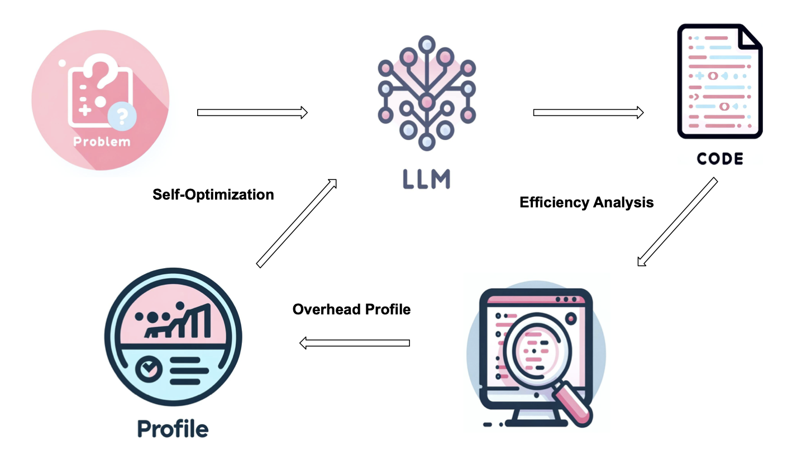
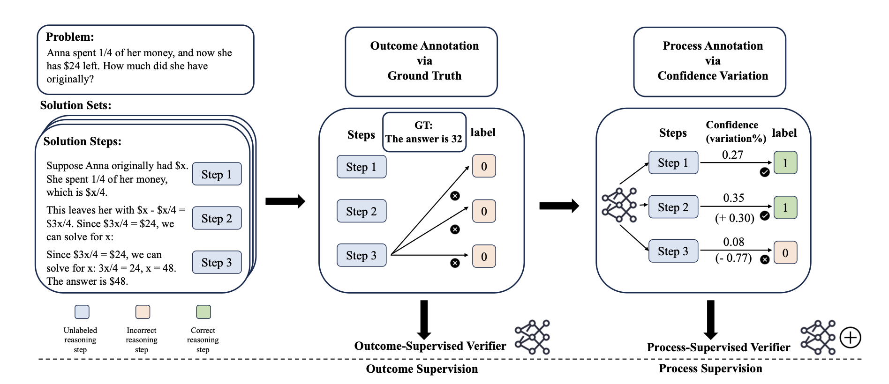
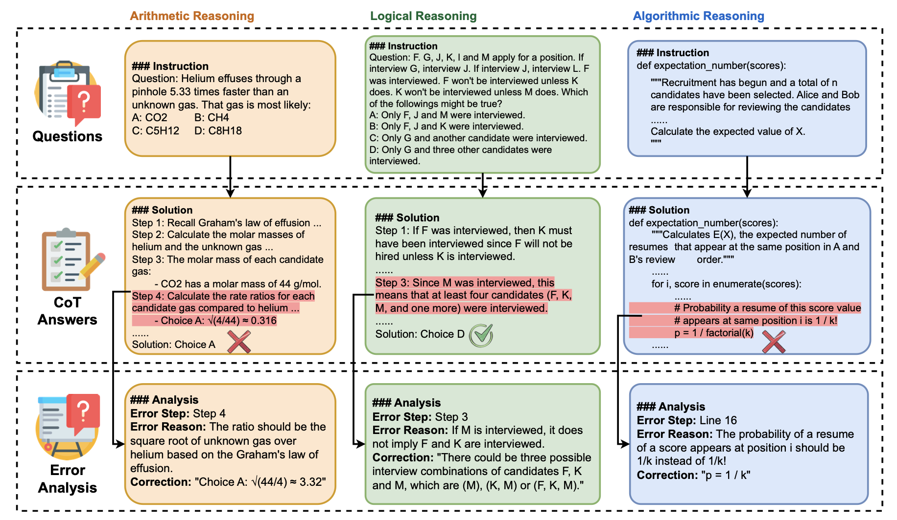
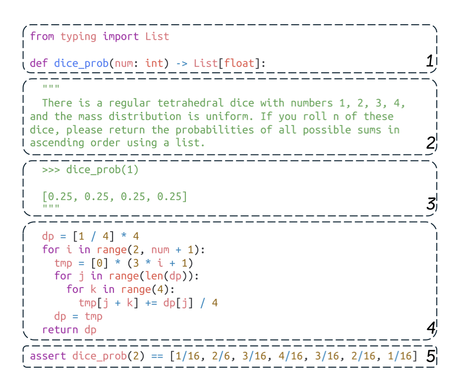
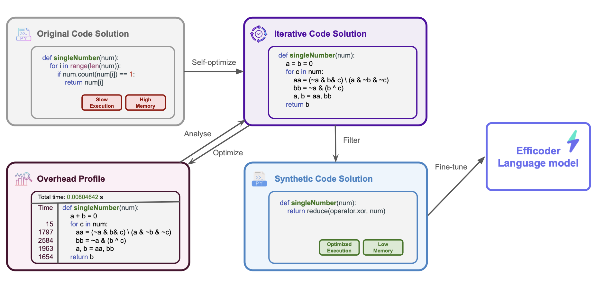

<html lang="en">
    <head>
        <meta charset="UTF-8">
        <title>Homepage</title>
    </head>
    <body>
        

            

            <h1>Jianbo Dai</h1>
            

                
                Hello! I am a research engineer focusing on NLP at <a href="https://www.noahlab.com.hk/#/home">Huawei Noah's Ark Lab</a>. I Got my Master Degree in Artificial Intelligence from <a href="http://www.inf.ed.ac.uk/">School of Informatics</a> of <a href="http://www.ed.ac.uk/">University of Edinburgh</a> where I learned machine learning and natural language processing. Previously, I had bachelors in <a href="https://www.manchester.ac.uk">University of Manchester</a> and <a href="http://en.dlut.edu.cn">Dalian University of Technology</a> but majored in Chemical Engineering. I used to be luckily supervised by <a href="http://homepages.inf.ed.ac.uk/sgwater/">Sharon Golderwater</a> for my master project on Morphological Analysis and Lemmatization. I also had an experience of doing summer research about semantic parsing of SQL with researchers from Yale LILY Group. My research interest basically falls in code intelligence and foundation models(LLM).
                 
                 
                To find more information about me, you can take a look at my CV (<a href="https://github.com/1e0ndavid/1e0ndavid.github.io/blob/master/assets/CV/CV_EN_1_3.pdf">English</a>
                / <a href="https://github.com/1e0ndavid/1e0ndavid.github.io/blob/master/assets/CV/CV_CN_1_2.pdf">Chinese</a>), updated 2020.07).
            

        

        

            <h2>News</h2>
            
 

            <ul>
                <li>
										Sep 26, 2024  Three papers are accepted at <a href="https://nips.cc/virtual/2024/papers.html?filter=titles">NeurIPS 2024</a>
								</li>
            </ul>
            
 

            <h2>Publications</h2>
            
 

            <ul>
              <li>
                <strong>EffiLearner: Enhancing Efficiency of Generated Code via Self-Optimization</strong> 
                Dong HUANG*, Jianbo Dai*, Han Weng, Puzhen Wu, Yuhao QING, Heming Cui, Zhijiang Guo, Jie Zhang 
                Accepted at <em>NeurIPS 2024</em> 
                 
                <a href="https://proceedings.neurips.cc/paper_files/paper/2024/hash/99c66755871ae101a4cef87c67fb29e8-Abstract-Conference.html">[Paper]</a><a href="https://github.com/huangd1999/EffiLearner">[Code]</a>
              </li>
              <li>
                <strong>AutoPSV: Automated Process-Supervised Verifier</strong> 
                Jianqiao Lu, Zhiyang Dou, Hongru WANG, Zeyu Cao, Jianbo Dai, Yunlong Feng, Zhijiang Guo 
                Accepted at <em>NeurIPS 2024</em> 
                 
                <a href="https://proceedings.neurips.cc/paper_files/paper/2024/hash/9246aa822579d9b29a140ecdac36ad60-Abstract-Conference.html">[Paper]</a><a href="https://github.com/rookie-joe/AutoPSV">[Code]</a>
              </li>
              <li>
                <strong>MR-Ben: A Meta-Reasoning Benchmark for Evaluating System-2 Thinking in LLMs</strong> 
                Zhongshen Zeng, Yinhong Liu, Yingjia Wan, Jingyao Li, Pengguang Chen, Jianbo Dai, Yuxuan Yao, Rongwu Xu, Zehan Qi, Wanru Zhao, Linling Shen, Jianqiao Lu, Haochen Tan, Yukang Chen, Hao Zhang, Zhan Shi, Bailin Wang, Zhijiang Guo, Jiaya Jia 
                Accepted at <em>NeurIPS 2024</em> 
                 
                <a href="https://proceedings.neurips.cc/paper_files/paper/2024/hash/d81cb1f4dc6e13aeb45553f80b3d6837-Abstract-Conference.html">[Paper]</a><a href="https://github.com/dvlab-research/Mr-Ben">[Code]</a><a href="https://randolph-zeng.github.io/Mr-Ben.github.io/">[Website]</a>
              </li>
              <li>
                <strong>MHPP: EXPLORING CAPABILITIES AND LIMITATIONS OF LANGUAGE MODELS BEYOND BASIC CODE GENERATION</strong> 
                Jianbo Dai*, Jianqiao Lu*, Yunlong Feng, Dong Huang, Guangtao Zeng, Rongju Ruan, Ming Cheng, Haochen Tan, Zhijiang Guo 
               <em>Arxiv</em> 
                 
                <a href="https://arxiv.org/pdf/2405.11430">[Paper]</a><a href="https://github.com/SparksofAGI/MHPP">[Code]</a><a href="https://sparksofagi.github.io/MHPP/">[Leaderboard]</a>
              </li>
              <li>
                <strong>Effi-Code: Unleashing Code Efficiency in Language Models</strong> 
                Dong Huang*, Guangtao Zeng*, Jianbo Dai, Meng Luo, Han Weng, Yuhao Qing, Heming Cui, Zhijiang Guo, Jie M. Zhang 
                <em>Arxiv</em> 
                 
                <a href="https://arxiv.org/pdf/2410.10209">[Paper]</a><a href="https://github.com/huangd1999/Effi-Code">[Code]</a>
              </li>
            </ul>
            
 

            <h2>Contact Information</h2>
            

                email me here: jianbodai819@gmail.com 
            

            

            
            <!-- hhmts start -->
            <!--Last modified: Mon Aug 15 17:31:26 BST 2011-->
            <!-- hhmts end -->
            
        

    </body>
</html>
